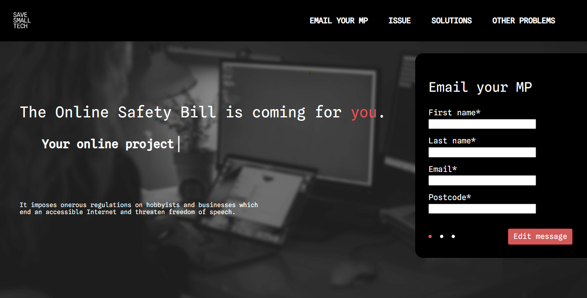

# #SaveSmallTech - Campaign to Reform the UK's Online Safety Bill

**Digital services in the UK are in danger.**

New legislation proposed by this government threatens them, imposing the need to:

- Write an illegal content risk assessment
- Write a content reporting risk statement
- Write a child risk assessment
- Age limit their site (Liz Truss recently claimed she would establish two separate Internets, one for young people and one for adults)
- Write a transparency report
- Register with the regulator
- Pay an annual regulation fee
- Designate a person to prepare a report to Ofcom if requested
- Attend an interview with Ofcom if requested
- Potentially _obtain legal advice_

These are just a handful of the onerous new regulations imposed by the Online Safety Bill.

The Bill has a noble aim: it seeks to prevent the exploitation of young people on online services which has led to many tragic outcomes in recent years, particularly on "Big Tech" platforms such as Facebook.

The Government has rightly agreed to clamp down on practices online which can be dangerous to children.

But this bill is **not** _"just targeting Big Tech"_.

Every home-baking website, maths quiz, online school project, hobbyist forum, online political campaign and movie blog will need to submit to these regulations, regardless of whether they pose any material threat.

The reality is that these new regulations will kill off small tech projects, businesses and websites. They will threaten the UK's digital industry, ending an accessible Internet.

Many services simply won't be able to comply with the new demands. As such, the diversity of Internet services in the UK will be eliminated as only the dominant incumbents can afford to comply with the regulations and retain their position.

But there is a simple solution, which comes in three simple precepts:

- Return thresholds: Initially the Bill would target only sites with an employee count or turnover above a given threshold, but these were removed. Returning these is the most effective way to protect young people, _and small tech._
- Require accountability: The Bill grants too much leeway for the Secretary of State to adjust aspects of the regulations, which should be decided solely by Parliament.
- Repeal and Rework sections 177(2) and 189(2) to remove draconian powers imposed by the Bill and catch-all clauses.

We urge you to join the campaign by emailing your MP with a customisable message about why we need to change the Online Safety Bill using the website: https://savesmalltech.org

You can find out a bit more about the Online Safety Bill here: https://webdevlaw.uk/2022/07/11/your-compliance-obligations-under-the-uks-online-safety-bill/

Thank you
